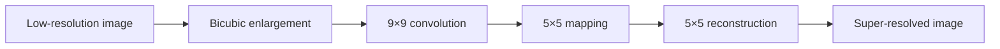

# PyTorch Image Super-Resolution

A reproducible, portfolio-ready implementation of SRCNN for single-image super-resolution. The project supports training, evaluation, and checkpoint inference on CPU, NVIDIA CUDA, and Apple Metal (MPS), with no notebook-only logic.



## Portfolio highlights

- Clean, installable `src/` package with typed APIs and a CLI.
- On-the-fly low/high-resolution pair generation from ordinary images.
- Automatic `cuda` → `mps` → `cpu` device selection.
- Deterministic seeding and chronological run metadata.
- PSNR and SSIM evaluation.
- Versioned checkpoints with model configuration and scale metadata.
- Unit tests, linting, and GitHub Actions CI.
- Synthetic demo-data generator for an immediate end-to-end smoke run.

## Quick start

Python 3.10 or newer is recommended.

```bash
python -m venv .venv
source .venv/bin/activate  # Windows: .venv\Scripts\activate
python -m pip install --upgrade pip
pip install -e ".[dev]"
```

Generate a tiny synthetic dataset and perform a short CPU smoke run:

```bash
python scripts/make_demo_data.py --output-dir data/demo

super-resolution train \
  --train-dir data/demo/train \
  --validation-dir data/demo/validation \
  --output-dir artifacts/demo \
  --scale 2 \
  --patch-size 64 \
  --epochs 2 \
  --batch-size 4 \
  --device cpu
```

The synthetic images verify the pipeline; they do not establish meaningful real-world quality.

## Train on real images

Place high-resolution training and validation images in separate directories. The loader accepts PNG, JPEG, BMP, TIFF, and WebP files and creates degraded pairs at runtime.

```bash
super-resolution train \
  --train-dir data/train \
  --validation-dir data/validation \
  --output-dir artifacts/srcnn-x2 \
  --scale 2 \
  --patch-size 96 \
  --epochs 20 \
  --batch-size 16 \
  --device auto
```

`auto` selects CUDA when available, then Apple MPS, then CPU. The best validation-PSNR checkpoint is written to `artifacts/srcnn-x2/best.pt`; the most recent checkpoint is `last.pt`.

## Pretrained-checkpoint inference

The inference command loads a checkpoint produced by this project, validates its scale metadata, performs bicubic enlargement, and applies SRCNN refinement:

```bash
super-resolution infer \
  --checkpoint artifacts/srcnn-x2/best.pt \
  --input examples/low-resolution.png \
  --output outputs/super-resolved.png \
  --device auto
```

No third-party weights are silently downloaded. Publish a checkpoint only after recording its dataset license, configuration, validation results, and SHA-256 digest. See [`docs/MODEL_CARD.md`](docs/MODEL_CARD.md).

## Evaluate a checkpoint

```bash
super-resolution evaluate \
  --checkpoint artifacts/srcnn-x2/best.pt \
  --data-dir data/test \
  --batch-size 4 \
  --device auto
```

The command reports MSE loss, PSNR, and SSIM. For a defensible comparison, evaluate the bicubic baseline on exactly the same images and crop policy.

## Project structure

```text
.
├── src/super_resolution/
│   ├── model.py          # SRCNN architecture
│   ├── data.py           # paired image dataset
│   ├── training.py       # training and validation loops
│   ├── inference.py      # checkpoint inference and evaluation
│   ├── metrics.py        # PSNR and SSIM
│   └── cli.py            # train, infer, evaluate commands
├── scripts/make_demo_data.py
├── tests/
├── docs/MODEL_CARD.md
└── .github/workflows/quality.yml
```

## Evaluation protocol

For portfolio or research results, record:

- Dataset name, version, license, and exact split.
- Scale factor and degradation process.
- Whether metrics use RGB or luminance and whether borders are cropped.
- Bicubic baseline and trained-model PSNR/SSIM.
- Seed, hardware, PyTorch version, epochs, and runtime.
- Parameter count and average inference latency.
- Representative successes and failures without cherry-picking.

This repository does not claim an unverified score.

## Limitations

SRCNN is intentionally small and educational. It will not match modern transformer or GAN-based methods on perceptual quality. Pixel losses can produce smooth results, PSNR/SSIM do not fully capture human preference, and performance depends strongly on whether test degradation matches training.

## Roadmap

- Publish a reproducible x2 checkpoint and completed model card.
- Add bicubic-baseline metrics to the evaluation command.
- Add tiled inference for very large images.
- Add residual and sub-pixel convolution baselines.
- Compare fidelity-oriented and perceptual objectives.
- Add an interactive before/after demonstration.

## Author

Mehdi Faraz — computer vision, machine learning, data science, and applied AI.

