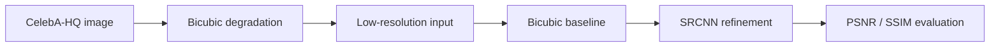

# Face Super-Resolution with PyTorch

A reproducible research codebase for studying single-image super-resolution on aligned
celebrity faces. The primary benchmark is **CelebA-HQ at x2 scale** and the initial model is
SRCNN, retained as a transparent fidelity-oriented baseline.

The repository contains code only. It does not redistribute CelebA-HQ images, trained weights,
or unverified results.



## Research questions

1. How much does SRCNN improve PSNR and SSIM over bicubic interpolation on aligned faces?
2. How sensitive is the improvement to scale, crop size, and random seed?
3. Where does a pixel-loss baseline fail on hair, teeth, eyes, accessories, and backgrounds?
4. Do gains measured on synthetic bicubic degradation transfer to naturally degraded images?

## Reproducibility contract

- Dataset splits are deterministic, manifest-based, and image-disjoint.
- Degraded inputs are generated on demand from high-resolution targets.
- Every evaluation reports the bicubic baseline on the same examples.
- Checkpoints store architecture, scale, epoch, optimizer state, and recorded metrics.
- No score is reported without a completed model card and experiment record.
- CPU, NVIDIA CUDA, and Apple MPS execution are supported.

## Install

Python 3.10 or newer is recommended.

```bash
python -m venv .venv
source .venv/bin/activate  # Windows: .venv\Scripts\activate
python -m pip install --upgrade pip
pip install -e ".[dev]"
```

## Prepare CelebA-HQ

CelebA-HQ contains 30,000 images at 1024×1024. Obtain and prepare it yourself under the
applicable CelebA/CelebA-HQ terms. The project intentionally has no automatic downloader because
the images may not be redistributed and CelebA is restricted to non-commercial research.
See [the dataset protocol](docs/DATASET.md) before proceeding.

Assuming the prepared images are under `data/CelebA-HQ/`:

```bash
python scripts/prepare_celeba_hq.py \
  --data-dir data/CelebA-HQ \
  --output-dir splits/celeba_hq \
  --seed 42
```

This validates the expected image count and writes `train.txt`, `validation.txt`, `test.txt`,
and `metadata.json`. Manifests contain only root-relative paths; images are neither copied nor
committed. The default 80/10/10 split is image-disjoint, not identity-disjoint.

## Train the x2 baseline

```bash
super-resolution train \
  --train-dir data/CelebA-HQ \
  --train-manifest splits/celeba_hq/train.txt \
  --validation-dir data/CelebA-HQ \
  --validation-manifest splits/celeba_hq/validation.txt \
  --output-dir artifacts/celeba-hq-srcnn-x2-seed42 \
  --scale 2 \
  --patch-size 96 \
  --epochs 20 \
  --batch-size 16 \
  --seed 42 \
  --device auto
```

`auto` selects CUDA, then MPS, then CPU. The best validation-PSNR checkpoint is saved as
`best.pt`, the latest as `last.pt`, and the complete configuration/history as `run.json`.

For a dependency-light smoke test, generate synthetic data first:

```bash
python scripts/make_demo_data.py --output-dir data/demo
super-resolution train --train-dir data/demo/train \
  --validation-dir data/demo/validation --output-dir artifacts/smoke \
  --epochs 1 --batch-size 4 --device cpu
```

Synthetic data tests the pipeline only; it is not a research result.

## Evaluate against bicubic

```bash
super-resolution evaluate \
  --checkpoint artifacts/celeba-hq-srcnn-x2-seed42/best.pt \
  --data-dir data/CelebA-HQ \
  --manifest splits/celeba_hq/test.txt \
  --batch-size 4 \
  --device auto
```

The JSON output includes SRCNN and bicubic MSE, PSNR, and SSIM, plus PSNR/SSIM gains. Use the
same checkpoint, manifest, degradation, crop, and color-space policy for every comparison.

## Inference

```bash
super-resolution infer \
  --checkpoint artifacts/celeba-hq-srcnn-x2-seed42/best.pt \
  --input examples/face-low-resolution.png \
  --output outputs/face-srcnn-x2.png \
  --device auto
```

Do not treat hallucinated or reconstructed facial detail as evidence of a person's identity,
appearance, or actions.

## Repository layout

```text
├── src/super_resolution/   # model, data, metrics, training, inference
├── scripts/                # local data preparation and smoke-data generation
├── tests/                  # unit tests
├── docs/
│   ├── DATASET.md          # access, license, bias, and split protocol
│   ├── EXPERIMENTS.md      # required experiment table and ablations
│   └── MODEL_CARD.md       # checkpoint reporting template
└── .github/workflows/      # lint and test checks
```

## Current status

Infrastructure and the SRCNN baseline are implemented. CelebA-HQ training, multi-seed
evaluation, qualitative error analysis, and checkpoint publication remain pending. This README
will not claim performance until those experiments are run and recorded.

## Limitations and responsible use

CelebA-HQ is a celebrity-face dataset derived from internet imagery. It carries demographic,
pose, styling, and selection biases and does not represent all people or capture conditions.
SRCNN optimizes pixel fidelity and often smooths high-frequency texture. Super-resolution can
also create plausible-looking detail that was never present in the input.

This work is for non-commercial research. It must not be used for face recognition, identity
verification, surveillance, biometric inference, forensics, or consequential decisions.

```
